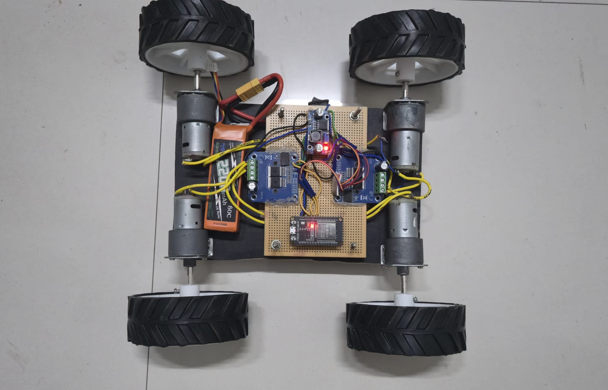
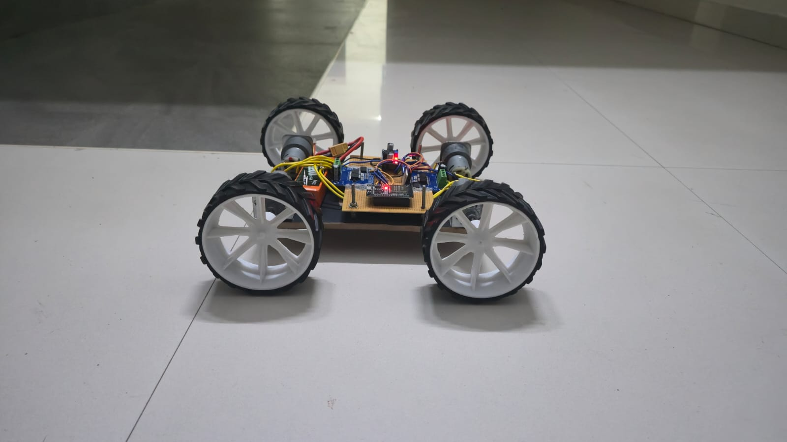
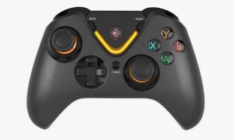

# 🎮 ESP32 Bluetooth RC Car

*Wireless robotics · HID gamepad input · Differential drive control*


---

<p align="center">
  
  &nbsp;&nbsp;
  
  <br/>
  <em>Bluetooth-controlled RC car · ESP32 + BTS7960 · arcade-drive control</em>
</p>

---

## 💡 The Idea

- **Problem** — Most ESP32 RC builds rely on phone apps over Wi-Fi: laggy input, clunky UIs, and the link dies the moment the router hiccups.
- **Approach** — Pair an off-the-shelf **Cosmic Byte Ares C3070W** gamepad directly to the ESP32 over **Bluetooth Classic (HID)** — the same protocol a PS4 controller uses to talk to a console.
- **Result** — Console-grade feel: ~20 ms latency, room-scale range, zero app maintenance, plug-and-play with any standard BT gamepad.

<p align="center">
  
  <br/>
  <em>Cosmic Byte Ares C3070W — Bluetooth HID gamepad</em>
</p>

---

## 🔋 System Architecture

```
┌─────────────────┐   BT HID    ┌──────────────┐   GPIO   ┌─────────────┐   ±7.4V   ┌──────────┐
│  Cosmic Byte    │ ─────────►  │  ESP32 DevKit│ ───────► │ BTS7960 ×2  │ ────────► │ Johnson  │
│  Ares C3070W    │             │      V1      │   PWM    │  H-Bridges  │           │ motors×4 │
└─────────────────┘             └──────────────┘          └─────────────┘           └──────────┘
                                       ▲                         ▲
                                       │                         │
                                  ┌──────────┐              ┌──────────┐
                                  │  LM2596  │ ◄─── 7.4V ── │ 2S Li-Ion│
                                  │  → 5V    │              │          │
                                  └──────────┘              └──────────┘
```

*End-to-end signal path: controller input → wireless link → MCU → motor driver → wheels.*

Full BOM → [`docs/BOM.md`](docs/BOM.md) · Wiring → [`docs/wiring.md`](docs/wiring.md)

---

## 🧩 Firmware

Two sketches, flashed in order. Stage 1 proves the wireless link. Stage 2 adds motion.

### 🕹️ [`01_joystick_test.ino`](firmware/01_joystick_test/01_joystick_test.ino) — Gamepad ↔ ESP32 Link

**Goal:** Confirm the controller pairs and streams clean data before any motor is wired in.

- Pairs the Cosmic Byte gamepad to the ESP32 over **Bluetooth HID** via Bluepad32
- Registers `onConnectedController()` / `onDisconnectedController()` callbacks for pair/unpair events
- Polls controller state every **10 ms** inside the main loop
- Reads **left stick Y** (throttle axis) and **right stick X** (steering axis)
- Applies a **15-count deadzone** to suppress idle stick drift
- Streams stick values + button states to serial @ **115200 baud**
- Prints the ESP32's **Bluetooth address** on boot for pairing reference

### 🚗 [`02_rc_drive.ino`](firmware/02_rc_drive/02_rc_drive.ino) — Full Motion Control

**Goal:** Turn two analog joystick axes into smooth, steerable wheel motion.

- **Arcade-drive mixing** — one pair of equations turns a tank chassis into a car:
```cpp
  throttle  = -axisY;       // invert so stick-up = forward
  steering  =  axisRX;
  leftWheel  = throttle + steering;
  rightWheel = throttle - steering;
```
- **Axis remap** — Bluepad32 raw `[-511, 512]` → PWM duty `[-255, 255]`, then `constrain()` to stay in range
- **Sign-based direction** — speed > 0 → forward · < 0 → reverse · 0 → coast
- **Hardware PWM** — 1 kHz, 8-bit, generated directly by the ESP32 (no CPU bit-banging)
- **Safety interlocks:**
  - 20-count deadzone on both axes
  - Master `EN` pin pulled LOW on controller disconnect → both BTS7960 bridges gate off instantly
  - Per-motor `constrain()` so integer overflow can't latch a full-throttle spin

---

## 🔌 Pinout

```
ESP32              BTS7960 (×2)
─────              ────────────
GPIO 12   ───────► L_RPWM    (left driver  — forward PWM)
GPIO 14   ───────► L_LPWM    (left driver  — reverse PWM)
GPIO 13   ───────► R_RPWM    (right driver — forward PWM)
GPIO 26   ───────► R_LPWM    (right driver — reverse PWM)
GPIO 33   ───────► EN        (tied to L_EN + R_EN on BOTH drivers)
                              HIGH = bridges enabled
                              LOW  = full coast / fail-safe

Free GPIOs : 27, 25  (available for encoders, IMU, etc.)
```

> 💡 **Why dual-PWM instead of one-PWM-plus-direction?** The BTS7960's RPWM/LPWM pins each drive one half of the H-bridge directly. Switching direction via two PWM lines gives you cleaner braking and avoids shoot-through, since RPWM and LPWM are never both high at once in the firmware.

---

## 🛠️ Getting Started

### 1. Clone the repo

```bash
git clone https://github.com/Moreshwar-R/ESP32-BT-RC-Car.git
cd ESP32-BT-RC-Car
```

### 2. Set up the toolchain

- Install the **Arduino IDE**
- Add the **ESP32 board package** via `File → Preferences → Additional Board Manager URLs`:
```
  https://raw.githubusercontent.com/espressif/arduino-esp32/gh-pages/package_esp32_index.json
```
- Install **Bluepad32** from `Tools → Manage Libraries`
- Select board: *ESP32 Dev Module* · Upload speed: *921600*

### 3. Flash & drive

1. Open `firmware/01_joystick_test/01_joystick_test.ino` → upload → pair the gamepad → confirm clean stick values on the serial monitor
2. Open `firmware/02_rc_drive/02_rc_drive.ino` → upload → wait for `CALLBACK: Controller connected` → drive

> 💡 **Tip:** If pairing fails, reset the ESP32 *while* the controller is in pairing mode. Bluepad32 only accepts new pairings during the initial boot window.

---

## 🚀 Roadmap

- 📈 **Closed-loop speed control** — wheel encoders + PID so commanded speed = actual speed regardless of battery sag
- 🔋 **BLE telemetry** — battery voltage and per-motor current streamed to a laptop dashboard
- 🛰️ **IMU-assisted traction control** — MPU6050 spin-out detection with asymmetric power cut
- 🧩 **Custom KiCad PCB** — collapse the breadboard wiring into a single ESP32 hat

---

## 🧠 What I Learned

- **Pair the controller before you trust the code** — flashing the joystick-test sketch alone saved hours of *"is it the controller, the code, or the motor driver?"* debugging later.
- **Untouched sticks still move** — without a 15-count deadzone, idle drift creeps the bot across the floor on its own.
- **A dropped controller is a runaway bot** — gating the H-bridge enable LOW on disconnect kills the drivers instantly. Fail-safes have to live in firmware, not in the README.
- **Two lines of math change the whole feel** — `left = throttle + steering`, `right = throttle - steering` turned a tank chassis into something that drives like a car.

---

## 🏷️ Topics


